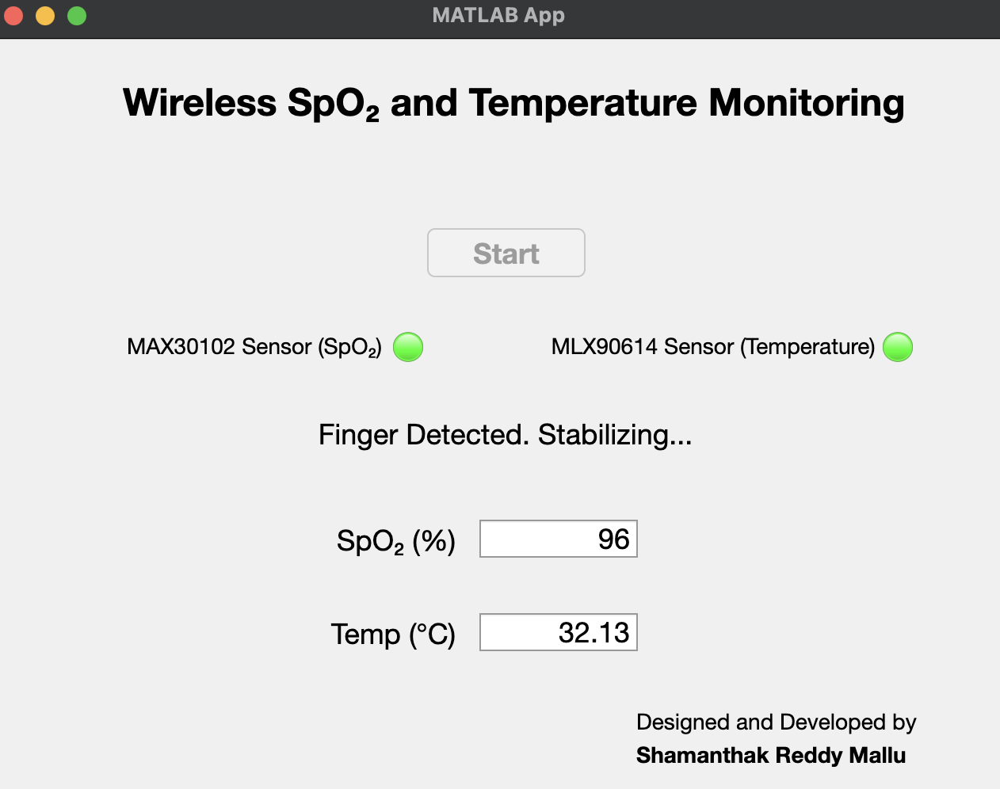

# VitalLink

A breadboard prototype that measures **SpO₂** and **non-contact temperature** with a Seeed Studio **XIAO ESP32-C3** and streams the readings over **Wi-Fi (TCP)** to a live **MATLAB App Designer** dashboard.

I built it in April–May 2025 as my course project for Digital Fundamentals (BITS F235) at BITS Pilani Hyderabad. The course version was called *"Wireless SpO₂ and Temperature Monitoring with ESP32-C3"*.

> ⚠️ **Not a medical device.** This is a student learning prototype. Its readings have not been validated against reference instruments and must not be used for diagnosis or any health decision.

<p align="center">
  
</p>

## How it works

```
MAX30102 (SpO₂) ─┐
                 ├─ I2C @ 100 kHz ─> XIAO ESP32-C3 ── Wi-Fi / TCP :5050 ──> MATLAB App (tcpserver)
MLX90614 (Temp) ─┘
```

1. The XIAO checks for a finger by averaging 10 IR samples. An average of at least 10000 means a finger is present.
2. It then collects 100 Red/IR samples and runs Maxim's SpO₂ algorithm.
3. It reads the MLX90614 object temperature.
4. It sends one text line per state to MATLAB over TCP.
5. The MATLAB app updates the fields, the status label and the two lamps. If nothing arrives for more than 12.5 s, it shows **Connection Lost**.

### Message format (final firmware, V4)

```
STATUS=NoFinger
STATUS=Stabilizing
STATUS=Data,SPO2=<int, -1 if invalid>,TEMP=<°C, 2 dp>
```

## Hardware

| Component | Qty | Notes |
|---|---|---|
| Seeed Studio XIAO ESP32-C3 (+ 2.4 GHz antenna) | 1 | Microcontroller + Wi-Fi |
| MAX30102 pulse oximeter module | 1 | SpO₂ (I2C, addr 0x57) |
| MLX90614 IR thermometer module | 1 | Object temperature (I2C, addr 0x5A) |
| Breadboard + jumper wires | – | Prototype wiring |
| USB-C cable | 1 | Powers everything |

### Wiring

| Sensor pin | XIAO pin |
|---|---|
| SDA (both sensors) | D4 (GPIO6) |
| SCL (both sensors) | D5 (GPIO7) |
| VIN (both sensors) | 5V |
| GND (both sensors) | GND |

## Repository structure

```
VitalLink/
├── Prototype/
│   ├── BodyTemp/          # MLX90614 standalone test (Serial)
│   ├── SpO2/              # MAX30102 standalone test, sliding-window SpO₂ (Serial)
│   ├── Combined/          # Both sensors on one I2C bus (Serial)
│   └── Receiver.m         # First MATLAB TCP receiver (command window only)
├── MATLABWiFi_V1/         # First Wi-Fi + TCP firmware
├── MATLABWiFi_V2/         # Adds Wi-Fi/TCP auto-reconnect
├── MATLABWiFi_V3/         # V2 logic on a different network + extra logging
├── MATLABWiFi_V4/         # Final firmware: STATUS= protocol  ← use this
├── App.mlapp              # Final MATLAB dashboard (R2024b only)
├── images/                # Dashboard screenshots
├── LICENSE
└── README.md
```

## Getting started

### Firmware
1. Install the **Arduino IDE** and the **ESP32 board package**, then select **XIAO_ESP32C3**.
2. Install these libraries:
   - **SparkFun MAX3010x Pulse and Proximity Sensor Library**, which provides `MAX30105.h` and `spo2_algorithm.h`
   - **Adafruit MLX90614 Library**
3. Open `MATLABWiFi_V4/MATLABWiFi_V4.ino` and fill in the blank values:
   ```cpp
   const char* ssid     = "";   // your Wi-Fi name
   const char* password = "";   // your Wi-Fi password
   const char* host     = "";   // IP address of the PC running MATLAB
   const uint16_t port  = 5050;
   ```
4. Upload to the XIAO.

### MATLAB dashboard
> **Requires MATLAB R2024b.** The app failed to run in R2024a, R2025a and R2025b. No extra toolboxes are needed.

1. Open `App.mlapp` in MATLAB R2024b and run it.
2. Press **Start**. This starts a TCP server on port 5050.
3. Power the XIAO. It connects automatically, and reconnects if the link drops.
4. Place a finger on the MAX30102.

The ESP32 and the PC must be on the same Wi-Fi network, and your firewall must allow incoming connections on port 5050.

## Dashboard states

| Waiting to start | Server running |
|---|---|
|  |  |
| **Live reading** | **Connection lost (>12.5 s without data)** |
|  |  |

## Known limitations

- The dashboard only shows the latest values; there are no graphs or logging.
- Both lamps turn green on *any* incoming message, so they don't check the actual health of each sensor.
- The firmware halts if either sensor is missing at boot.
- V4 re-sends `Stabilizing` before every reading, so the status label flickers.
- Invalid SpO₂ appears as `-1`.
- Heart rate is calculated but never sent.
- There's no motion-artifact or ambient-light handling, and no temperature calibration. The MLX90614 reads skin temperature, not core body temperature.
- It has not been validated against a reference oximeter or thermometer.

## Author

**Shamanthak Reddy Mallu**

## License

See [LICENSE](LICENSE).
